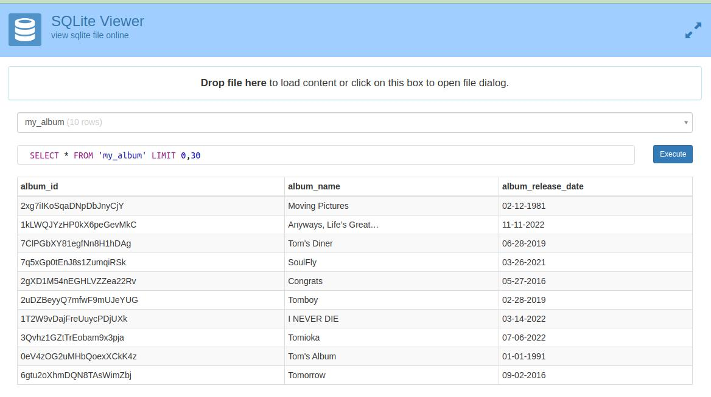
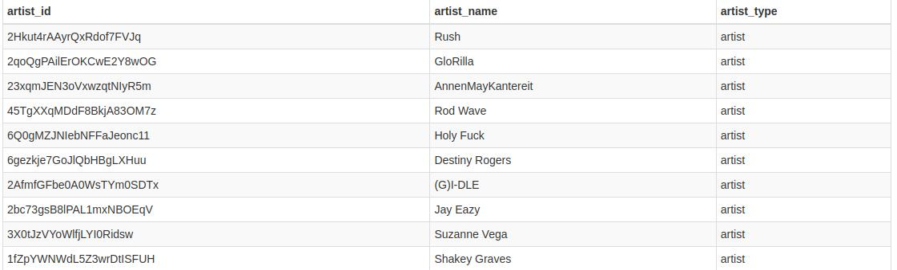
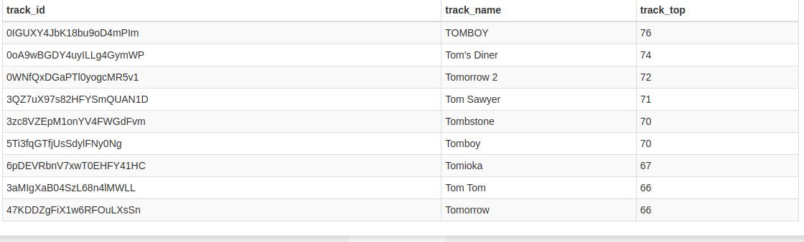

Building Spotify ETL using Python and Airflow

Create an Extract Transform Load pipeline using python and automate with airflow.

Image by Author

Inthis blog post, will explain how to create a simple ETL(Extract, Transform, Load) pipeline using Python and automate the process through Apache airflow.

# Problem Statement:

We need to use Spotify’s API to read the data and perform some basic transformations and Data Quality checks finally will load the retrieved data to PostgreSQL DB and then automate the entire process through airflow.  **Est.Time:**[4–7 Hours]

# Tech Stack / Skill used:

1.  Python
2.  API’s
3.  Docker
4.  Airflow
5.  PostgreSQL

# Building ETL Pipeline:

**Dataset:** In this project, we are using Spotify’s API so please go ahead and create an account for yourself. After creating the account head to this  [page](https://developer.spotify.com/documentation/web-api/reference/search). Now you will be able to see a get token icon click that and select user recently played and click get token in file **requestapi.py**

Now, this is the procedure to get the token. You may need to generate this often as it expires after some time.

## Extract.py

We are using this token to Extract the Data from Spotify. We are Creating a function return_dataframe(). The Below python code explains how we extract API data and convert it to a Dataframe.

## Transform.py

Here we are exporting the Extract file to get the data.

**def Data_Quality(check_song):** Used to check for the empty data frame, enforce unique constraints, checking for null values. Since these data might ruin our database it's important we enforce these Data Quality checks.

**def Transform_df(album_df, artist_df, track_df):** In the album_df, remove all symbols and parentheses from the album_name column, and process the album_release_date column by converting it to the given date format month-day-year. In the track_df, rename a column and sort the top_track column in descending order

## Load.py

In the load step, we are using sqlalchemy and SQLite to load our data into a database and save the file in our project directory.

Finally, we have completed our ETL pipeline successfully. The structure of the project folder should look like this(inside the project folder we have 3 datanase my_album, my_artist, my_track).

**my_album**

**my_artist**

**my_track**

